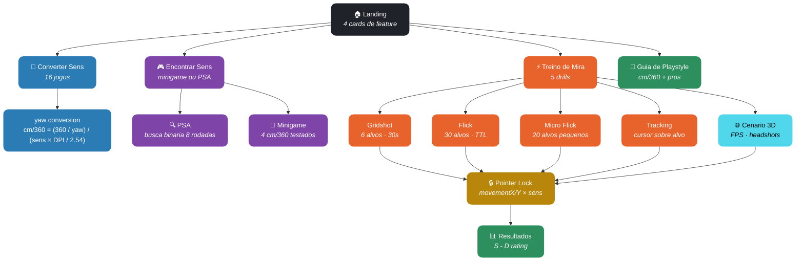

<div align="center">

# Sensi Watcher

**Conversor de sensibilidade entre 16 jogos FPS + treino de mira em 3D — 100% no navegador.**

[](https://typescriptlang.org)
[](https://react.dev)
[](https://vite.dev)
[](https://threejs.org)
[](https://tailwindcss.com)
[](#license)

[Demo](https://johnpitter.github.io/sensi-watcher/) · [Features](#-features) · [Como Funciona](#-como-funciona) · [Tech Stack](#-tech-stack) · [Desenvolvimento](#-desenvolvimento)

</div>

---

## O que e o Sensi Watcher?

Sensi Watcher e uma aplicacao web que ajuda jogadores de FPS a **converter sensibilidade entre jogos**, **encontrar a sensibilidade ideal** atraves de testes interativos, e **treinar a mira** com 5 modos de drill incluindo um cenario 3D estilo AimLab.

Funciona inteiramente no navegador. Suas preferencias (mira customizada, cor de inimigos, sensibilidade) ficam salvas em `localStorage` — **nada e enviado para servidores**.

---

## Features

| Categoria | O que voce ganha |
|---|---|
| **Conversor de Sens** | Converte sensibilidade entre **16 jogos** preservando cm/360 — CS2, Valorant, Apex, Overwatch 2, Fortnite, R6 Siege, COD, PUBG, e mais |
| **Encontrar Sens Ideal** | Dois metodos: minigame de mira que testa 4 sensibilidades realistas baseadas no seu DPI, ou metodo PSA (busca binaria com feedback manual) |
| **Treino de Mira — 5 Modos** | Gridshot · Flick · Micro Flick · Tracking · **Cenario 3D** (humanoides peeking de cover, headshot detection) |
| **Cenario 3D Real** | Three.js + React Three Fiber: paredes, mapa, alvos humanoides com cabeca/corpo, ring de glow, iluminacao |
| **Pointer Lock + Sens** | 6 multiplicadores (0.5x - 2x) aplicados via Pointer Lock API — sentir-se igual no browser e no jogo |
| **Mira Customizavel** | 6 estilos (cruz, cruz aberta, ponto, circulo, T, chevron) que seguem o cursor virtual em todos os modos |
| **Cor dos Inimigos** | 6 presets (ciano, vermelho, verde, amarelo, roxo, branco) que tingem material, glow, luz pontual e mira |
| **Ranking S - D** | Cada drill termina com pontuacao, rating S/A/B/C/D, precisao, reacao media, headshots, HS rate |
| **Guia de Playstyle** | Escala visual de cm/360 com referencias de pro players e dicas para ajustar sua sens |
| **Persistencia Local** | Sensibilidade, mira e cor de inimigos sobrevivem reloads via localStorage |
| **Code-Splitting** | Three.js lazy-loaded — bundle inicial leve (399KB), 3D so carrega ao abrir o Cenario |

---

## Como Funciona



### Conversao de Sensibilidade

Cada jogo expoe um **valor de yaw** (graus de rotacao de camera por unidade de mouse). A formula que preserva sentir-se igual entre jogos e:

```
cm/360 = (360 / yaw_jogo) / (sens × DPI / 2.54)
```

O conversor calcula o cm/360 do jogo de origem e resolve para `sens` no jogo de destino mantendo o cm/360 constante. Os 16 perfis ja incluem yaw correto, range de sens valido e step de incremento.

### Pointer Lock + Sensibilidade

Para que a sensibilidade seja **realmente** aplicada (nao so visualmente), todos os modos usam a [Pointer Lock API](https://developer.mozilla.org/docs/Web/API/Pointer_Lock_API):

1. Click na arena -> `requestPointerLock()` captura o cursor
2. Mousemove fornece `movementX/Y` (deltas em pixels OS)
3. Posicao virtual = previa + delta × multiplicador (0.5x - 2x)
4. Click sintetico e despachado na posicao virtual via `dispatchEvent` — handlers existentes (2D onClick, raycaster R3F) recebem normalmente
5. ESC libera o lock; click novamente retoma

### Cenario 3D

Construido com Three.js + React Three Fiber:

- **Mapa**: 5 cover blocks + paredes laterais/fundo, grid de chao com perspectiva real, fog
- **Alvos humanoides**: capsula (corpo) + esfera (cabeca) com material `MeshStandardMaterial`, `emissive`, glow ring no chao
- **Headshot detection**: hits separados na esfera-cabeca (+700pts) vs capsula-corpo (+120pts)
- **Spawn**: 1-2 inimigos simultaneos em peek points proximos aos covers, TTL com blink antes de expirar
- **Customizacao em tempo real**: cor flui de UI -> material `color`+`emissive`, point light, ring, mira accent

---

## Tech Stack

| Camada | Tecnologia |
|---|---|
| **Framework** | React 19 + TypeScript 5.9 |
| **Build** | Vite 8 |
| **Styling** | Tailwind CSS 4 |
| **3D Engine** | Three.js r184 + React Three Fiber 9 + drei |
| **Animacoes** | Framer Motion 12 |
| **Icons** | Lucide React |
| **Pointer Input** | Pointer Lock API + custom virtual cursor |
| **Persistencia** | localStorage (sens, mira, cor) |
| **Deploy** | GitHub Pages (GitHub Actions) |

---

## Desenvolvimento

### Pre-requisitos

- Node.js 20+
- npm

### Setup

```bash
# Clone
git clone https://github.com/JohnPitter/sensi-watcher.git
cd sensi-watcher

# Instale dependencias
npm install

# Dev server
npm run dev

# Build de producao
npm run build

# Preview do build
npm run preview

# Lint
npm run lint
```

### Estrutura

```
src/
  App.tsx                       # Navegacao por tabs (home/converter/finder/trainer/guide)
  engine/
    sensitivity.ts              # Formulas cm/360, sensFromCm360, convertSensitivity
  data/
    games.ts                    # 16 perfis de jogo (yaw, sensRange, sensStep)
  components/
    Converter.tsx               # Tela do conversor
    SensiFinder.tsx             # PSA + minigame
    PlaystyleGuide.tsx          # Escala visual de cm/360
    LandingHero.tsx             # Landing com simulacao FPS
    AimLab.tsx                  # Treino de mira (5 drills)
    Cenario3D.tsx               # Cena 3D Three.js (lazy-loaded)
    Cenario3DUI.tsx             # CrosshairShape + presets (sem three.js)
    AimTrainer.tsx              # Mini-arena 2D usada pelo SensiFinder
    GameSelect.tsx, NumberInput.tsx, StatBlock.tsx, AllGamesTable.tsx
  hooks/
    useArenaPointerLock.ts      # Pointer lock + virtual cursor + click sintetico
```

---

## Privacidade

- Nenhum dado e enviado para servidores
- Nenhum cookie, nenhum rastreamento
- Apenas `localStorage` para preferencias de UI
- Codigo fonte aberto para auditoria

---

## License

MIT License — use livremente.
